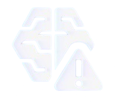
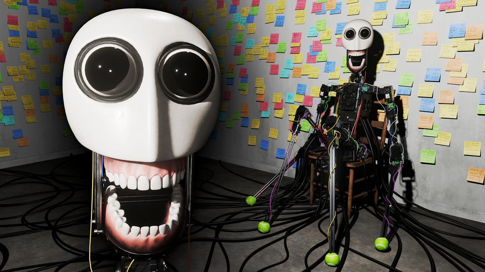
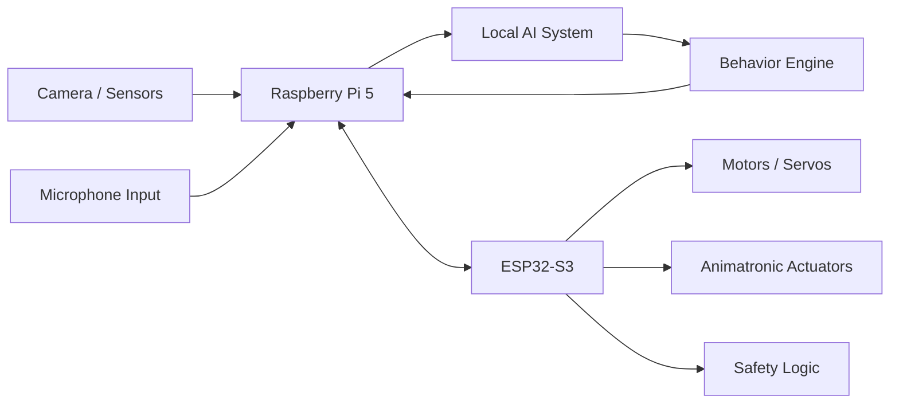

<div align="center">
  

  <h1>E.L.B.E.R.R.</h1>

  <p>
    A fanmade animatronic robot powered by local AI, embedded control systems,
    and custom hardware.
  </p>

  <p>
    <a href="https://github.com/0Zane/E.L.B.E.R.R./stargazers">
      
    </a>
    <a href="https://github.com/0Zane/E.L.B.E.R.R./issues">
      
    </a>
    
    
    
    
  </p>
</div>

---

## Overview

**E.L.B.E.R.R.** is a fanmade animatronic project inspired by the robot featured
in the animations from [LIGHTS ARE OFF](https://www.youtube.com/@LIGHTSAREOFF).

The goal of this project is to recreate the character as a physical animatronic
robot using a custom local AI system, embedded motor control, sensors, and
purpose-built hardware. E.L.B.E.R.R. is designed as a self-contained robot that
can process information locally, control its own actuators, and respond through
real-time embedded systems.

> This is an unofficial fan project. It is not affiliated with, endorsed by, or
> produced by LIGHTS ARE OFF.

<div align="center">
  
  <br />
  <sub>Reference image of the robot from the original animation.</sub>
</div>

---

## Core Concept

E.L.B.E.R.R. is built around a split architecture:

- A **Raspberry Pi 5** acts as the main computer for local AI, behavior logic,
  perception, and high-level coordination.
- An **ESP32-S3** handles real-time control for motors, actuators, sensors, and
  safety-critical embedded behavior.

This separation keeps the robot responsive while still allowing the main system
to run more advanced AI and decision-making software.



---

## Hardware Architecture

| Subsystem | Component | Purpose |
| --- | --- | --- |
| Main computer | Raspberry Pi 5 | Local AI, behavior logic, vision, audio, networking, and orchestration |
| Real-time controller | ESP32-S3 | Motor control, sensor polling, low-latency responses, and hardware safety |
| Mechanical system | Animatronic frame | Physical movement, expression, and character presence |
| Sensors | Cameras, microphones, and embedded sensors | Environmental input and interaction data |
| PCB design | KiCad | Custom circuit design, wiring organization, and hardware integration |
| Firmware | C++ | Embedded logic for actuator and peripheral control |

---

## Raspberry Pi 5

The Raspberry Pi 5 is the central processing unit of E.L.B.E.R.R.

Its responsibilities include:

- Running the local AI system
- Managing high-level robot behavior
- Processing camera, microphone, and sensor input
- Coordinating communication with the ESP32-S3
- Handling networking, logging, and debugging tools
- Making behavior decisions before sending commands to the embedded controller

The Pi is responsible for what the robot "thinks" and how it chooses to behave.

---

## ESP32-S3

The ESP32-S3 is responsible for the fast embedded layer of the robot.

Its responsibilities include:

- Driving motors, servos, and animatronic actuators
- Reading direct hardware sensors
- Handling timing-sensitive motion control
- Enforcing safety limits and fallback behavior
- Receiving high-level commands from the Raspberry Pi 5
- Translating behavior commands into precise hardware movement

The ESP32-S3 is responsible for how the robot physically reacts.

---

## Local AI System

E.L.B.E.R.R. is designed around a local AI system created specifically for this
project.

The local AI layer is intended to support:

- Character behavior and personality logic
- Environmental awareness from sensors
- Voice or sound-based interaction
- Autonomous decision-making
- Offline operation where possible
- Communication with the embedded control layer

Keeping the AI local makes the robot more self-contained and gives the project
more control over latency, behavior, and privacy.

---

## Project Structure

```text
E.L.B.E.R.R./
|-- firmware/
|   |-- src/
|   |   `-- main.cpp
|   |-- include/
|   |   |-- pins.h
|   |   `-- readposition.h
|   |-- lib/
|   |-- test/
|   `-- platformio.ini
|-- hardware/
|   |-- pcb/
|   `-- README.md
|-- ai/
|   |-- models/
|   |-- behavior/
|   `-- README.md
|-- docs/
|   `-- images/
|-- elberr.jpg
|-- elberr.png
|-- README.md
`-- LICENSE
```


---

## Technologies

| Area | Technology |
| --- | --- |
| Main compute | Raspberry Pi 5 |
| Embedded control | ESP32-S3 |
| Firmware | C++ |
| PCB design | KiCad |
| 3D modeling | Fusion360 |
| AI | Local custom AI system |
| Architecture | Distributed embedded system |

---

## Safety Notes

Animatronics combine electronics, moving parts, power systems, and mechanical
force. E.L.B.E.R.R. is being designed with safety in mind.

Planned safety considerations include:

- Motion limits for servos and actuators
- Emergency stop behavior
- Power isolation where needed
- Current and thermal awareness
- Firmware-level failsafes
- Clear wiring and connector documentation

---

## Inspiration

This project is inspired by the robot created in the animations from
[LIGHTS ARE OFF](https://www.youtube.com/@LIGHTSAREOFF).

E.L.B.E.R.R. is a fanmade physical interpretation of that concept, built as a
personal robotics, AI, and embedded systems project.

---

## License

This project is licensed under the **MIT License**.

See the [LICENSE](./LICENSE) file for details.
